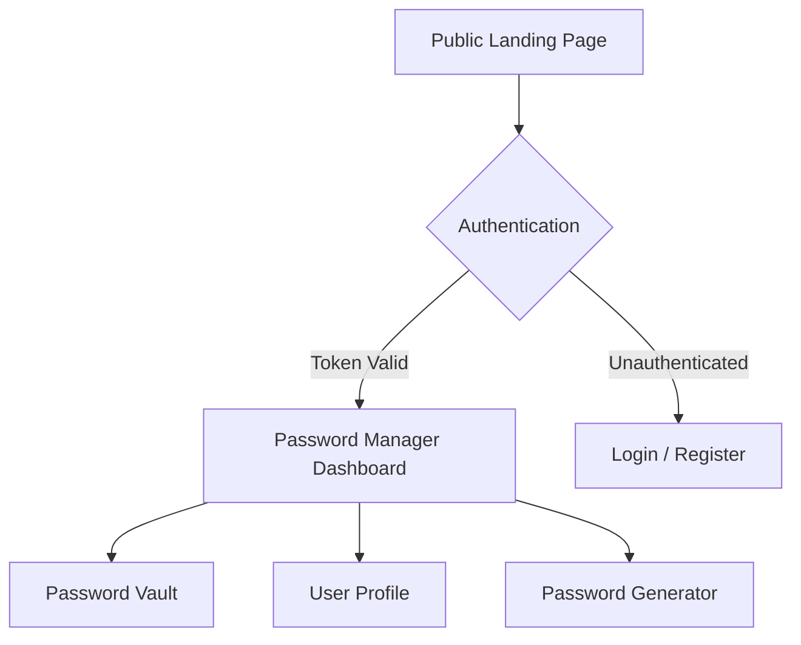
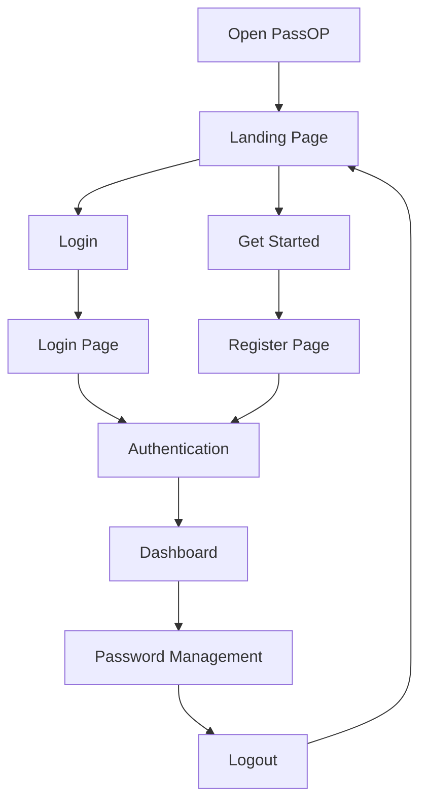

# PassOP — Password Manager

## 1. Project Overview
PassOP is a secure, modern web application designed to help users store, manage, and organize their credentials for different online services from a single, unified interface. It uses industry-standard encryption practices to ensure that your sensitive data remains entirely private and secure in your personal digital vault.

## 2. Key Features
- **Secure Password Vault**: Safely store website URLs, usernames, and passwords.
- **User Authentication**: Secure login and registration utilizing hashed master passwords or Google OAuth integration.
- **Full Password Management**: Complete capability to Add, View, Edit, and Delete saved passwords from your vault.
- **Password Generation**: Instantly generate complex, strong passwords when adding a new account.
- **Dynamic Theming**: Seamless switching between Dark Mode and Light (Bright) Mode.
- **Protected Routes**: Your dashboard and vault data are restricted strictly to authenticated sessions.

## 3. Technology Stack
### Frontend
- **Framework**: React 19 (via Vite)
- **Styling**: Tailwind CSS v4, custom glassmorphism components
- **Routing**: React Router DOM v7
- **Icons**: Lucide React
- **Notifications**: Sonner
- **API Client**: Axios

### Backend
- **Runtime**: Node.js
- **Framework**: Express.js
- **Database**: MongoDB (via Mongoose)
- **Authentication**: JSON Web Tokens (JWT), `@react-oauth/google`
- **Security**: bcryptjs (for password hashing)

## 4. Website Architecture

The core architecture separates the public-facing entry point from the private user vault:

## 5. Landing Page

The newly integrated Landing Page serves as the public entry point of the website (`/`). It introduces users to the application before they commit to registering or logging into their vault. 

Based on the actual project implementation, the Landing Page consists of the following sections:
- **Navigation Bar**: Clean public navigation including Home, Features, About, Contact, and direct links to Login/Get Started.
- **Hero Section**: A high-impact introduction clearly explaining the value of PassOP with a direct call to action.
- **Features Section**: Highlights of the app's capabilities (Secure Storage, Password Generation, User Authentication, Full Management).
- **How It Works**: A clear 4-step workflow explaining the onboarding journey.
- **Security**: Explanation of the technical standards used (bcrypt hashing, JWT authentication).
- **Call To Action (CTA)**: A prompt encouraging new users to secure their digital life.
- **Footer**: Branding, site navigation, and standard links.

## 6. Landing Page Workflow

This workflow represents the exact navigation paths available to a user navigating through the PassOP application:

### Important Routing Rules:
1. **`/`** is always the public Landing Page.
2. **`/dashboard`** is the authenticated Password Manager Dashboard.
3. The existing dashboard is separate from the landing page.
4. Clicking Login/Register navigates you through the authentication routes (`/login`, `/signup`).
5. Upon successful authentication, the user is directly navigated to `/dashboard`.
6. Selecting Logout securely terminates the session and returns the user to `/`.
7. Any unauthenticated user attempting to directly access `/dashboard` (or any other protected route) is safely redirected back to `/login`.
